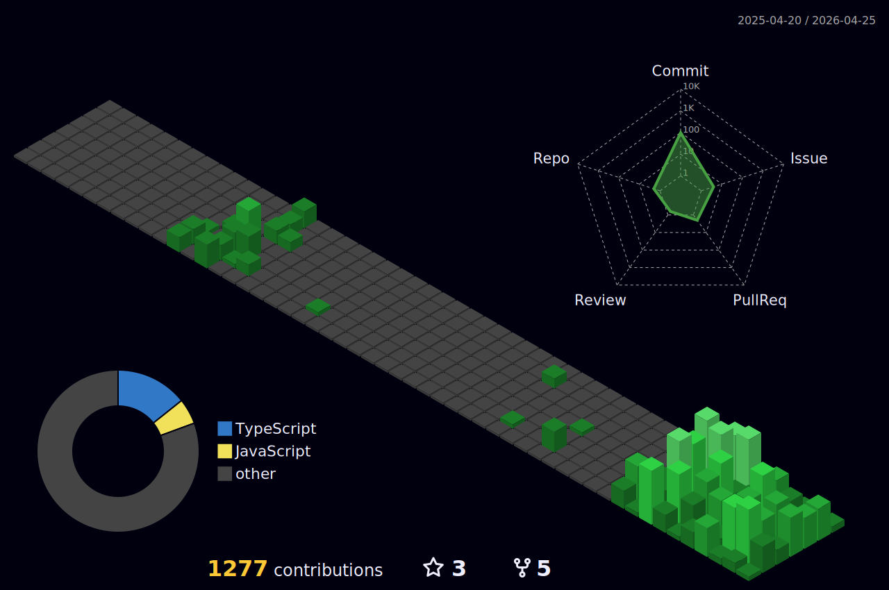

<div align="center">

<!-- CUSTOM ANIMATED SVG HEADER -->


<br/>

<!-- TYPING SVG -->

<a href="https://git.io/typing-svg"></a>

<br/>

<!-- SOCIAL BADGES -->

[](https://www.linkedin.com/in/rishabhsethia20/)
[](https://github.com/EmperorAkashi20/)
[](https://www.twitter.com/__rishabh/)
[](https://www.instagram.com/rishabhsethia20/)
[](mailto:hello@rishabhsethia.com)

<br/>


</div>

---

<!-- CURRENTLY WORKING ON -->

## 🔭 &nbsp;`status.now()`

```js
const rishabh = {
  building: "production-grade AI/ML and full-stack apps",
  exploring: ["machine learning", "blockchain", "AI-powered dev tools"],
  learning: "always something new — currently deep in ML pipelines",
  askMeAbout: ["flutter", "react", "system design", "scaling apps", "AI tools"],
  reachMe: "hello@rishabhsethia.com",
  funFact:
    "I've mass-deleted a prod database at 2am. I learned backups aren't optional.",
};
```

<table>
<tr>
<td width="50%" valign="top">

### 🔭 &nbsp;Currently Building

Mobile, web, and AI-powered products in production — obsessing over performance, clean architecture, and shipping fast.

### 🌱 &nbsp;Currently Learning

ML pipelines, LLM integrations, and exploring how **AI tools** can 10x developer productivity.

</td>
<td width="50%" valign="top">

### 💬 &nbsp;Ask Me About

Flutter, React, Next.js, system design, scalable architectures, and AI-assisted development workflows.

### ⚡ &nbsp;Fun Fact

Started coding before teenage years with **Logo** and **QBASIC**. The terminal has been home ever since.

</td>
</tr>
</table>

---

<!-- TECH STACK -->

## ⚡ &nbsp;Tech Arsenal

<div align="center">

**`// frameworks & libraries`**


**`// languages`**


**`// cloud, databases & infra`**


**`// dev environment`**


</div>

---

<!-- WAKATIME STATS -->

## ⏱️ &nbsp;Weekly Coding Stats

<!--START_SECTION:waka-->

```
From: 14 February 2026 - To: 21 February 2026

Total Time: 1 hr 18 mins

Markdown     28 mins               █████████░░░░░░░░░░░░░░░░   35.92 %
TypeScript   23 mins               ███████▒░░░░░░░░░░░░░░░░░   29.84 %
YAML         14 mins               ████▓░░░░░░░░░░░░░░░░░░░░   18.48 %
Dart         12 mins               ███▓░░░░░░░░░░░░░░░░░░░░░   15.27 %
Git          0 secs                ░░░░░░░░░░░░░░░░░░░░░░░░░   00.36 %
Bash         0 secs                ░░░░░░░░░░░░░░░░░░░░░░░░░   00.13 %
```

<!--END_SECTION:waka-->

---

<!-- 3D CONTRIBUTION CALENDAR -->

## 🏙️ &nbsp;Contribution Skyline

<div align="center">
  <picture>
    <source media="(prefers-color-scheme: dark)" srcset="./profile-3d-contrib/profile-night-green.svg" />
    <source media="(prefers-color-scheme: light)" srcset="./profile-3d-contrib/profile-green-animate.svg" />
    
  </picture>
</div>

---

<!-- CONTRIBUTION CALENDAR -->

## 🟩 &nbsp;Contribution Calendar

<div align="center">
  <picture>
    <source media="(prefers-color-scheme: dark)" srcset="https://ghchart.rshah.org/58a6ff/EmperorAkashi20" />
    <source media="(prefers-color-scheme: light)" srcset="https://ghchart.rshah.org/2ea44f/EmperorAkashi20" />
    
  </picture>
</div>

---

<!-- SNAKE ANIMATION -->

## 🐍 &nbsp;Watch the Snake Eat My Contributions

<div align="center">
  <picture>
    <source media="(prefers-color-scheme: dark)" srcset="https://raw.githubusercontent.com/EmperorAkashi20/EmperorAkashi20/output/github-snake-dark.svg" />
    <source media="(prefers-color-scheme: light)" srcset="https://raw.githubusercontent.com/EmperorAkashi20/EmperorAkashi20/output/github-snake.svg" />
    
  </picture>
</div>

---

<!-- GITHUB STATS -->

## 📊 &nbsp;GitHub Analytics

<div align="center">


<br/>


<br/>


</div>

<br/>

<div align="center">
  <a href="https://git.io/streak-stats"></a>
</div>

<br/>

<div align="center">
  
</div>

---

<!-- CONNECT -->

<div align="center">

**Let's build something together.**

<a href="mailto:hello@rishabhsethia.com">
  
</a>

<br/><br/>


</div>
