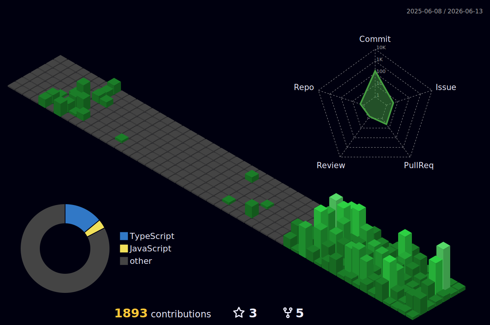

<div align="center">

<!-- ANIMATED SVG HEADER -->


<br/>

<!-- TYPING SVG -->
<a href="https://github.com/EmperorAkashi20">
  
</a>

<br/>

<!-- SOCIAL BADGES -->
[](https://www.linkedin.com/in/rishabhsethia20/)
[](https://www.twitter.com/__rishabh/)
[](https://www.instagram.com/rishabhsethia20/)
[](mailto:hello@rishabhsethia.com)

<br/>


</div>

---

<!-- WHOAMI -->

## &nbsp;`~ whoami`

```ts
const rishabh: Engineer = {
  role: "Full-Stack & AI/ML Engineer",
  building: "production-grade mobile, web & AI-powered products",
  stack: ["Flutter", "Next.js", "TypeScript", "Node", "GraphQL", "PostgreSQL"],
  exploring: ["ML pipelines", "LLM integrations", "AI-powered dev tools"],
  philosophy: "clean architecture, ship fast, sweat the details",
  since: "wrote my first line before my teens — Logo & QBASIC",
  funFact: "mass-deleted a prod DB at 2am. backups aren't optional. lesson learned.",
}
```

<table>
<tr>
<td width="50%" valign="top">

### &nbsp;🔭&nbsp; Currently Building
Mobile, web & AI-powered products in production — obsessing over performance, clean architecture, and shipping fast without cutting corners.

### &nbsp;🌱&nbsp; Currently Learning
ML pipelines, LLM integrations, and how **AI tooling** can genuinely 10x the way engineers build.

</td>
<td width="50%" valign="top">

### &nbsp;💬&nbsp; Ask Me About
Flutter, React, Next.js, GraphQL, system design, scalable architectures, and AI-assisted development workflows.

### &nbsp;⚡&nbsp; How I Work
Small commits, honest tests, docs that stay current, and a terminal that never closes.

</td>
</tr>
</table>

---

<!-- TECH ARSENAL -->

## &nbsp;`~ tech --stack`

<div align="center">

**Languages**


**Frameworks & Libraries**


**Cloud, Data & Infra**


**Tooling**


</div>

---

<!-- FEATURED WORK -->

## &nbsp;`~ ls ./featured`

<table>
<tr>
<td width="50%" valign="top">

### 💸 &nbsp;[Budget Tracker](https://github.com/EmperorAkashi20/budget-tracker-app)
A full-stack personal finance app — track spending, set budgets, visualise it all.
<br/>
`TypeScript` · `Node` · [backend →](https://github.com/EmperorAkashi20/budget-tracker-backend)

</td>
<td width="50%" valign="top">

### 🤖 &nbsp;[ChatGPT × Flutter](https://github.com/EmperorAkashi20/chat_gpt_with_flutter)
A cross-platform Flutter client wired up to the ChatGPT API for on-the-go conversations.
<br/>
`Flutter` · `Dart` · `LLM`

</td>
</tr>
<tr>
<td width="50%" valign="top">

### 📈 &nbsp;[Crypto Ticker](https://github.com/EmperorAkashi20/crypto_ticker)
A clean Flutter app streaming live cryptocurrency prices in real time.
<br/>
`Flutter` · `Dart` · `REST`

</td>
<td width="50%" valign="top">

### 🔴 &nbsp;[Pokédex](https://github.com/EmperorAkashi20/pokedex)
A polished Flutter Pokédex — smooth lists, detail views, and API-driven data.
<br/>
`Flutter` · `Dart` · `API`

</td>
</tr>
</table>

<div align="center">

[](https://github.com/EmperorAkashi20?tab=repositories)

</div>

---

<!-- CONTRIBUTION SKYLINE -->

## &nbsp;`~ git log --graph`

<div align="center">
  <picture>
    <source media="(prefers-color-scheme: dark)" srcset="./profile-3d-contrib/profile-night-green.svg" />
    <source media="(prefers-color-scheme: light)" srcset="./profile-3d-contrib/profile-green-animate.svg" />
    
  </picture>
</div>

---

<!-- WAKATIME STATS -->

## &nbsp;`~ time --this-week`

<!--START_SECTION:waka-->

```
From: 16 July 2026 - To: 23 July 2026

Total Time: 40 hrs 40 mins

Liquid        11 hrs 18 mins        ██████▓░░░░░░░░░░░░░░░░░░   27.18 %
Markdown      10 hrs 1 min          ██████░░░░░░░░░░░░░░░░░░░   24.07 %
TypeScript    4 hrs 31 mins         ██▓░░░░░░░░░░░░░░░░░░░░░░   10.87 %
CSS           4 hrs 4 mins          ██▒░░░░░░░░░░░░░░░░░░░░░░   09.81 %
Dart          3 hrs 53 mins         ██▒░░░░░░░░░░░░░░░░░░░░░░   09.33 %
JavaScript    3 hrs 3 mins          ██░░░░░░░░░░░░░░░░░░░░░░░   07.34 %
YAML          1 hr 29 mins          █░░░░░░░░░░░░░░░░░░░░░░░░   03.57 %
HTML          1 hr 11 mins          ▓░░░░░░░░░░░░░░░░░░░░░░░░   02.87 %
```

<!--END_SECTION:waka-->

---

<!-- CONNECT -->

<div align="center">

### &nbsp;`~ echo "let's build something"`

Got an idea worth shipping? I'm always up for a good conversation.

<a href="mailto:hello@rishabhsethia.com">
  
</a>

<br/><br/>


</div>
